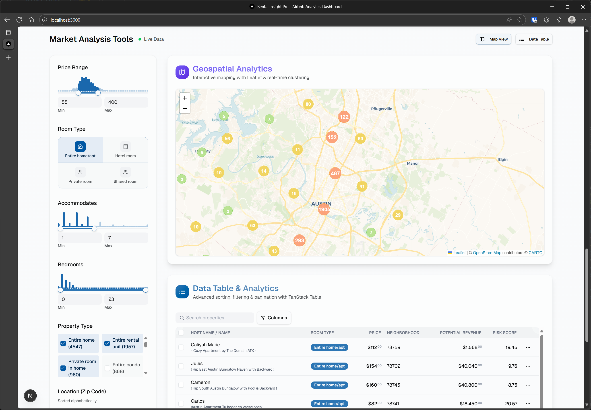

Austin Airbnb Analytics with NextJS / tanstack / tRPC / shadCN/ui



## Database Setup

This project uses PostgreSQL with Drizzle ORM. Environment-based configuration is supported for local development and production (Supabase).

### Local Development

1. Ensure PostgreSQL is running locally on port 5432 with a database named `rental_insight`.
2. The `.env.local` file is configured with the local database URL.

### Production (Supabase)

1. Create a Supabase project at [supabase.com](https://supabase.com).
2. Go to Project Settings > Database and copy the PostgreSQL connection string.
3. Update `.env.production` with your Supabase connection string:
   ```
   DATABASE_URL=postgresql://postgres:[YOUR_PASSWORD]@[YOUR_HOST]:5432/postgres
   ```
4. For deployment, set the `DATABASE_URL` environment variable in your hosting platform.

### Migrations

Run migrations using Drizzle:

```bash
npx drizzle-kit generate
npx drizzle-kit migrate
```

## Getting Started

First, run the development server:

```bash
npm run dev
# or
yarn dev
# or
pnpm dev
# or
bun dev
```

Open [http://localhost:3000](http://localhost:3000) with your browser to see the result.

